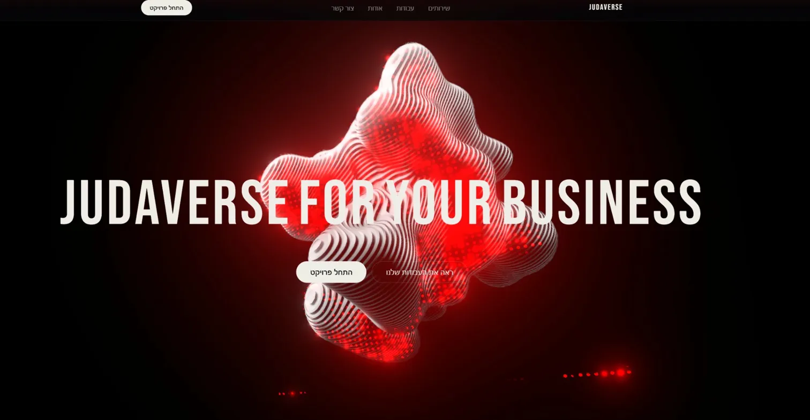

# judaverse-landing-skill

A Claude Code skill for building **premium landing pages** with 21st.dev MCP components and data-driven design decisions.

---

## What it does

When you ask Claude Code to build a website or landing page, this skill kicks in and follows a strict 5-step workflow:

1. Collects business name, style, animation preference, and stack
2. Searches local design data (BM25) for the best layout, animation, and stack config
3. Pulls premium components from the **21st.dev MCP**
4. Builds a full page: Navbar → Hero → Marquee → Services → Stats → CTA → Footer
5. Writes real business copy — no `Lorem Ipsum`, no placeholder text

---

## Preview



---

## Installation

### 1. Copy the skill into your project

```bash
cp -r .claude/skills/landing-builder/ YOUR_PROJECT/.claude/skills/landing-builder/
cp -r scripts/ YOUR_PROJECT/scripts/
cp -r data/ YOUR_PROJECT/data/
```

### 2. Configure 21st.dev MCP in Claude Code

Add to your Claude Code MCP settings (`~/.claude/settings.json` or project `.claude/settings.json`):

```json
{
  "mcpServers": {
    "magic": {
      "command": "npx",
      "args": ["-y", "@21st-dev/magic@latest"],
      "env": {
        "API_KEY": "YOUR_21ST_DEV_API_KEY"
      }
    }
  }
}
```

Get your API key at [21st.dev](https://21st.dev).

---

## Usage

Once installed, just describe what you want:

```
Build a landing page for my AI agency called NexaLabs. Dark style with particles animation.
```

```
דף נחיתה לקליניקת שיניים. עברית. סגנון מינימליסטי בהיר.
```

```
Website for my freelance design portfolio. Brutalist style, Next.js.
```

Claude will ask for any missing details, search the design data, pull components from 21st.dev, and build the complete page.

---

## File Structure

```
judaverse-landing-skill/
├── .claude/
│   └── skills/
│       └── landing-builder/
│           └── SKILL.md          ← skill logic Claude follows
├── scripts/
│   └── search.py                 ← BM25 search (no external deps)
└── data/
    ├── animations.csv            ← 19 animation options
    ├── components.csv            ← 33 section components
    ├── layouts.csv               ← 20 page layouts by business type
    └── stacks.csv                ← 10 framework setups
```

---

## Search Script

The script powers Step 2 of the workflow. Run it directly to explore the data:

```bash
python3 scripts/search.py "dark AI agency" --domain layout
python3 scripts/search.py "particles"      --domain animation
python3 scripts/search.py "nextjs"         --domain stack
python3 scripts/search.py "hero section"  --domain component
```

No dependencies — pure Python standard library.

---

## Extending the Data

All data files use `|` as the delimiter. Add rows to any CSV to expand the skill's design vocabulary.

---

## Requirements

- Python 3.10+
- Claude Code with 21st.dev MCP configured

---

## Credit

Inspired by the [ui-ux-pro-max](https://github.com/nextlevelbuilder) skill by **nextlevelbuilder**.
